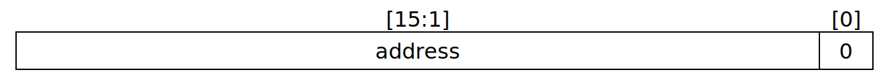
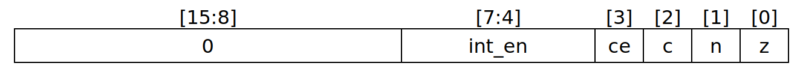
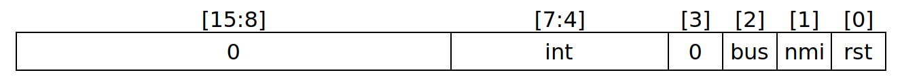

{
	type=DATASHEET,
	status=PUBLISHED,
	title = "The SPU Mark II Architecture",
	part = "ACT-SPU-II",
	date = Date(2024,05,26),
	revision = Version(1,12),
}

# The SPU Mark II Architecture

## Documentation Style

### Numbers

Numbers are documented in three ways:

Decimal numbers are written the usual style. Hexadecimal numbers are prefixed by a `0x`. Binary numbers are postfixed with a subscript ₂. If both decimal and binary notation are given, the decimal notation is postfixed with a subscript ₁₀ to make the difference clear.

Examples:

- Decimal numbers: `10`, `23`, `44`₁₀
- Hexadecimal: `0x10`, `0xFF`, `0xCC3D`
- Binary: `10`₂, `1100101`₂
- Mixed binary and decimal: `10`₂ (2₁₀), `1100`₂ (12₁₀)

### Bit Ranges

This document uses some special notations to define bit ranges or indices.

`[n]` is a placeholder for the _nth_ bit in a word.

`[n:m]` is a placeholder for the bit range from the _nth_ (highest significant bit) to the _mth_ (lowest significant bit).

So `[3]` means the the bit with the significance of `2³` and `[7:4]` is the upper nibble of a 8 bit word.

### Wording

#### Undefined (value)

If a value is defined undefined, its initial value may be any possible value. The value may change between power cycles or even after a reset. Each bit must be considered random.

#### _Undefined behavior_

Undefined behavior is used similar to the way the C standard uses this word. It means that if a situation happens where undefined behavior would occur, the results of the operation may be anything. This can be a _no-op_, any state or memory change or even a CPU hang or hard reset (may even requires a power cycle).

## CPU Variants

This document specifies two different variants for the SPU Mark II architecture:

- SPU Mark II
- SPU Mark II-L

The SPU Mark II-L is a reduced version of the default instruction set and features no interrupt handling, thus making an implementation of the ISA much easier.

## SPU Mark II Architecture

The SPU Mark II (Stack Processing Unit Mark II) is a 16 bit processor that, in contrary to the most popular CPUs, works primarily with a stack instead of registers. It features a RISC instruction set with highly configurable instructions. Although being a stack processor it still requires some basic registers to work. These registers are either accessed indirectly (like the `IP` register) or by special instructions (like `BP` or `SP` register).

Each instruction is composed of a _configuration_ part and a _command_ part. Commands are the actual function of the instruction like `STORE8` or `MUL`. Each command has two input variables `input0` and `input1` which contain the two command parameters. A command also has an output value.

In which way the command parameters are filled and the result is processed is defined by the _configuration_ bits of the instruction. These bits allow conditional execution, input parameter modification, affect flags and define how the result of the command is processed.

As each instruction may be conditional, there are no special conditional jump commands. In fact, there isn't even a jump command at all. A jump is done by taking the output of a command to be the next instruction pointer.

Thus, the most simple `COPY` command can be used already for a whole set of different operations: `jmp $imm`, `push $imm`, `pop` and many more.

### Basic Properties

#### Word Encoding and Signedness

The SPU Mark II uses the little endian encoding, so the less significant byte is at the lower address, the more significant byte at the higher address.

Integer arithmetic uses two-complement signed integers. This allows most arithmetic instructions to be used with signed and unsigned values.

#### Memory Access

The cpu only allows aligned memory access for word access. Unaligned word access must be programmed manually.

### CPU Registers

#### Stack Pointer (_SP_)

16 bit register storing the address of the topmost value of the stack. The stack grows downwards, so a _push_ operation decrements the `SP` by two and then stores a value to the decremented address. A _pop_ or _peek_ operation reads the value from `SP`, and for _pop_, `SP` will be incremented by 2.



| Bit Fields | Description               |
| ---------- | ------------------------- |
| `[0]`      | reserved, must be zero    |
| `[15:1]`   | aligned stack top address |

Initial Value: _Undefined_

#### Base Pointer (_BP_)

16 bit register that may be used for indirect addressing via `GET` and `SET` commands and may be used as a _frame pointer_ or _index register_.


| Bit Fields | Description            |
| ---------- | ---------------------- |
| `[0]`      | reserved, must be zero |
| `[15:1]`   | aligned address        |

Initial Value: _Undefined_

#### Instruction Pointer (_IP_)

16 bit register pointing to the instruction to be executed next.


| Bit Fields | Description                 |
| ---------- | --------------------------- |
| `[0]`      | reserved, must be zero      |
| `[15:1]`   | aligned instruction address |

Initial Value: _Undefined_

#### Flag Register (_FR_)

16 bit register saving CPU state and interrupt system



| Bit Range | Name       | Description                                      |
| --------- | ---------- | ------------------------------------------------ |
| `[0]`     | **Z**      | Zero Flag                                        |
| `[1]`     | **N**      | Negative Flag                                    |
| `[2]`     | **C**      | Carry                                            |
| `[3]`     | **CE**     | Carry Enable                                     |
| `[7:4]`   | **I[3:0]** | Interrupt Enabled bitfield for interrupts 4 to 7 |
| `[15:8]`  | -          | Reserved, must be _0_.                           |

Initial Value: `0x0000`

> **Note:** The flags `I[3:0]` are not available in _SPU Mark II-L_

#### Interrupt Register (_IR_)

16 bit register storing internal interrupt information.



| Bit Range | Name         | Description                      |
| --------- | ------------ | -------------------------------- |
| `[0]`     | **RST**      | Reset was triggered              |
| `[1]`     | **NMI**      | Non-maskable interrupt triggered |
| `[2]`     | **BUS**      | Bus error triggered              |
| `[3]`     | -            | Reserved, must be _0_            |
| `[4]`     | **ARITH**    | `ARITH` was triggered            |
| `[5]`     | **SOFTWARE** | `SOFTWARE` was triggered         |
| `[6]`     | **RESERVED** | `RESERVED` was triggerd          |
| `[7]`     | **IRQ**      | `IRQ` was triggered              |
| `[15:8]`  | -            | Reserved (must be 0)             |

Initial Value: `0x0001` (Reset interrupt triggered)

> **Note:** Not available in _SPU Mark II-L_

### Instruction Encoding

Instructions use 16 bit opcodes organized in different bit fields defining the behaviour of the instruction:


| Bit Range | Description                           |
| --------- | ------------------------------------- |
| `[2:0]`   | Execution Conditional                 |
| `[4:3]`   | Input 0 Behaviour                     |
| `[6:5]`   | Input 1 Behaviour                     |
| `[7:7]`   | Flag Modification Behaviour           |
| `[8:8]`   | Output Behaviour                      |
| `[14:9]`  | Command                               |
| `[15:15]` | Reserved for future use (must be `0`) |

#### Conditional Execution

This field determines when the command is executed or ignored. The execution is dependent on the current state of the flags.

This allows conditional execution of all possible opcodes.

| Value        | Enumeration | Description                                                              |
| ------------ | ----------- | ------------------------------------------------------------------------ |
| `000`₂ (0₁₀) | Always      | The command is always executed                                           |
| `001`₂ (1₁₀) | =0          | The command is executed when result is zero (`Z=1`)                      |
| `010`₂ (2₁₀) | ≠0          | The command is executed when result is not zero (`Z=0`)                  |
| `011`₂ (3₁₀) | >0          | The command is executed when result is positive (`Z=0` and `N=0`)        |
| `100`₂ (4₁₀) | <0          | The command is executed when result is less than zero (`N=1`)            |
| `101`₂ (5₁₀) | ≥0          | The command is executed when result is zero or positive (`Z=1` or `N=0`) |
| `110`₂ (6₁₀) | ≤0          | The command is executed when result is zero or negative (`Z=1` or `N=1`) |
| `111`₂ (7₁₀) | Overflow    | The command is executed when _Carry_ is set.                             |

#### Argument Input 0 and 1

These two fields define what arguments are provided to the executed command.

| Value       | Enumeration | Description                                              |
| ----------- | ----------- | -------------------------------------------------------- |
| `00`₂ (0₁₀) | Zero        | The input register will be zero.                         |
| `01`₂ (1₁₀) | Immediate   | The input registers value is located after this command. |
| `10`₂ (2₁₀) | Peek        | The input register will be the stack top.                |
| `11`₂ (3₁₀) | Pop         | The input register will be popped from the stack.        |

_Zero_ means that the argument will be zero, _Immediate_ means that it will be fetched from the instruction pointer (it is located behind the opcode in memory). _Peek_ will take the argument from the stack top, but won't change the stack and _Pop_ will take the argument from the stack top and decreases the stack pointer.

`input0` is fetched before `input1` so when both arguments pop a value, `input0` receives the stack top and `input1` receives the value one below the stack top. Likewise, when both arguments use the _Immediate_ option, the value for `input0` must located directly after the opcode, `input1` directly after `input0`.

#### Flag Modification

When the flag modification is enabled, the current `N` and `Z` flags will be overwritten by this command. Otherwise the flags stay as they were before the instruction.

| Value      | Enumeration | Description                                            |
| ---------- | ----------- | ------------------------------------------------------ |
| `0`₂ (0₁₀) | No          | The flags won't be modified.                           |
| `1`₂ (1₁₀) | Yes         | The flags will be set according to the command output. |

The flags are modified according to this table:

| Flag   | Condition          |
| ------ | ------------------ |
| **Z**  | `output[15:0] = 0` |
| **N**  | `output[15] = 1`   |
| **C**  | unchanged          |
| **CE** | unchanged          |
| **I**  | unchanged          |

#### Output Behaviour

Each command may output a value which can be processed in various ways. The output could be pushed to the stack, the command could be made into a jump or the output could be ignored.

| Value      | Enumeration | Description                                     |
| ---------- | ----------- | ----------------------------------------------- |
| `0`₂ (0₁₀) | Discard     | The command output will be ignored.             |
| `1`₂ (1₁₀) | Push        | The command output will be pushed to the stack. |

For _Jump Relative_, the instruction pointer will point to the next instruction plus `output` words. `output` is considered a two-complements signed number. This differs from the _Jump_ behavior which takes an address, not a word offset.

#### Commands

Commands are what define the core behaviour of the opcode. They allow arithmetics, modification of memory, changing system registers and so on.

Some hints on notation:

- `MEM16[x]` is the 16 bit word at address `x`
- `MEM8[x]` is the 8 bit word at address `x`

Executing instructions not defined in the list below are considered undefined behaviour and may do any behaviour.

If a register has a subscript `₀`, it means that this refers to the value _before_ the instruction is executed. If there is a subscript `₁`, it means that this refers to the value _after_ the instruction was executed. **Note:** `₀` still

| Value            | Name       | Pseudo-Code                                                         |
| ---------------- | ---------- | ------------------------------------------------------------------- |
| `000000`₂ (0₁₀)  | COPY       | `output = input0`                                                   |
| `000001`₂ (1₁₀)  | _reserved_ |                                                                     |
| `000010`₂ (2₁₀)  | GET        | `output = MEM16[BP + 2 * input0]`                                   |
| `000011`₂ (3₁₀)  | SET        | `output = input1; MEM16[BP + 2 * input0] = input1`                  |
| `000100`₂ (4₁₀)  | STORE8     | `output = input0 & 0xFF; MEM8[input1] = input0`                     |
| `000101`₂ (5₁₀)  | STORE16    | `output = input0; MEM16[input1] = input0`                           |
| `000110`₂ (6₁₀)  | LOAD8      | `output = MEM8[input0]`                                             |
| `000111`₂ (7₁₀)  | LOAD16     | `output = MEM16[input0]`                                            |
| `001000`₂ (8₁₀)  | CPUID      | _See below_                                                         |
| `001001`₂ (9₁₀)  | HALT       | _See below_                                                         |
| `001010`₂ (10₁₀) | FRGET      | `output = (FR & ~input1)`                                           |
| `001011`₂ (11₁₀) | FRSET      | `output = FR₀; FR₁ = (input0 & ~input1) \| (FR₀ & input1)`          |
| `001100`₂ (12₁₀) | BPGET      | `output = BP`                                                       |
| `001101`₂ (13₁₀) | BPSET      | `output = BP₀; BP₁ = input0`                                        |
| `001110`₂ (14₁₀) | SPGET      | `output = SP`                                                       |
| `001111`₂ (15₁₀) | SPSET      | `output = SP₀; SP₁ = input0`                                        |
| `010000`₂ (16₁₀) | ADD        | `output = input0 + input1 + (C & CE)`                               |
| `010001`₂ (17₁₀) | SUB        | `output = input0 - input1 - (C & CE)`                               |
| `010010`₂ (18₁₀) | MUL        | `output = input0 * input1`                                          |
| `010011`₂ (19₁₀) | DIV        | `output = input0 / input1`                                          |
| `010100`₂ (20₁₀) | MOD        | `output = input0 % input1`                                          |
| `010101`₂ (21₁₀) | AND        | `output = input0 & input1`                                          |
| `010110`₂ (22₁₀) | OR         | `output = input0 \| input1`                                         |
| `010111`₂ (23₁₀) | XOR        | `output = input0 ^ input1`                                          |
| `011000`₂ (24₁₀) | NOT        | `output = ~input0`                                                  |
| `011001`₂ (25₁₀) | SIGNEXT    | `output = if(input[7] = 1) (0xFF00 \| input0) else (input0 & 0xFF)` |
| `011010`₂ (26₁₀) | ROL        | `output = concat(input0[14:0], input0[15])`                         |
| `011011`₂ (27₁₀) | ROR        | `output = concat(input0[0], input0[15:1])`                          |
| `011100`₂ (28₁₀) | BSWAP      | `output = concat(input0[7:0], input0[15:8])`                        |
| `011101`₂ (29₁₀) | ASR        | `output = concat(input0[15], input0[15:1])`                         |
| `011110`₂ (30₁₀) | LSL        | `output = concat(input0[14:0], '0')`                                |
| `011111`₂ (31₁₀) | LSR        | `output = concat('0', input0[15:1])`                                |
| `100000`₂ (32₁₀) | SETIP      | `output = IP₀; IP₁ = input0; FR₁ = FR₀ \| input1`                   |
| `100001`₂ (33₁₀) | ADDIP      | `output = IP₀; IP₁ = IP₀ + input0; FR₁ = FR₀ \| input1`             |
| `100010`₂ (34₁₀) | INTR       | `output = input0; IR = IR \| input0`                                |
| `100011`₂ (35₁₀) | _reserved_ |                                                                     |
| `100100`₂ (36₁₀) | _reserved_ |                                                                     |
| `100101`₂ (37₁₀) | _reserved_ |                                                                     |
| `100110`₂ (38₁₀) | _reserved_ |                                                                     |
| `100111`₂ (39₁₀) | _reserved_ |                                                                     |
| `101000`₂ (40₁₀) | _reserved_ |                                                                     |
| `101001`₂ (41₁₀) | _reserved_ |                                                                     |
| `101010`₂ (42₁₀) | _reserved_ |                                                                     |
| `101011`₂ (43₁₀) | _reserved_ |                                                                     |
| `101100`₂ (44₁₀) | _reserved_ |                                                                     |
| `101101`₂ (45₁₀) | _reserved_ |                                                                     |
| `101110`₂ (46₁₀) | _reserved_ |                                                                     |
| `101111`₂ (47₁₀) | _reserved_ |                                                                     |
| `110000`₂ (48₁₀) | _reserved_ |                                                                     |
| `110001`₂ (49₁₀) | _reserved_ |                                                                     |
| `110010`₂ (50₁₀) | _reserved_ |                                                                     |
| `110011`₂ (51₁₀) | _reserved_ |                                                                     |
| `110100`₂ (52₁₀) | _reserved_ |                                                                     |
| `110101`₂ (53₁₀) | _reserved_ |                                                                     |
| `110110`₂ (54₁₀) | _reserved_ |                                                                     |
| `110111`₂ (55₁₀) | _reserved_ |                                                                     |
| `111000`₂ (56₁₀) | _reserved_ |                                                                     |
| `111001`₂ (57₁₀) | _reserved_ |                                                                     |
| `111010`₂ (58₁₀) | _reserved_ |                                                                     |
| `111011`₂ (59₁₀) | _reserved_ |                                                                     |
| `111100`₂ (60₁₀) | _reserved_ |                                                                     |
| `111101`₂ (61₁₀) | _reserved_ |                                                                     |
| `111110`₂ (62₁₀) | _reserved_ |                                                                     |
| `111111`₂ (63₁₀) | _reserved_ |                                                                     |

`MUL`, `DIV` and `MOD` use signed values as input and output. It is not possible to get the upper 16 bit of the multiplication result.

`ADD` and `SUB` will add/subtract 1 more if the _Carry_ and _Carry Enabled_ flag are both set.

`ADD`, `SUB`, `MUL` will modify the _Carry_ flag, even if _Carry Enabled_ flag or _Modify Flags_ instruction field is disabled:

- When `ADD` is overflowing and setting a virtual 17th bit, carry will be set
- When `SUB` is overflowing and setting a virtual 17th bit, carry will be set
- When `MUL` is overflowig and setting any bits in the upper half of the virtual 32 bit result, carry will be set.

In all other cases when one of the carry modifying command is invoked, carry is cleared. Other commands then those specified above will not modify carry in any way.

##### `CPUID`

This instruction is meant to return the current set of CPU features or possible future extensions. For now, this instruction requires both `input0` and `input1` to be zero, the output will be `zero` as well.

##### `HALT`

Stops execution of instructions until an interrupt happens _and_ interrupts are enabled.

### Memory Access

Only 2-aligned access to memory is possible with code or data. Only exception are the `STORE8` and `LOAD8` commands which allow 1-aligned memory access.

When accessing memory with alignment, the least significant address bit is reserved and must be `0`. If the bit is `1`, the behavior is undefined.

### Fetch-Execute-Cycle

This pseudocode documents what the CPU does in detail when execution a single instruction.

```py
if (IR & 1) != 0:
	IP := fetch(0x0000)
	FR := 0x0000
	IR := 0x0000

while IR != 0:
	intr_bit := indexOfHighestSetBit(IR)
	IR &= ~(1<<intr_bit)         # clear "interrupt triggered"
	if intr_bit < 4 or (FR & (1<<intr_bit)) != 0: # if interrupt is not masked
		push(1<<intr_bit)
		push(IP)
		IP := fetch(2 * intr_bit)   # fetch ISR handler
		if intr_bit >= 4:           # if interrupt is maskable
			FR &= ~(1<<intr_bit)      # unmask interrupt

instruction := fetch(IP)
IP += 2

if isExecuted(instruction, FR):
	input0 := fetchInput(instruction.input0)
	input1 := fetchInput(instruction.input1)

	output := instruction.command(input0, input1)

	select instruction.output:
		when 'push':
			push(output)
		when 'discard':
			# ignore
		when 'jmp':
			IP := output
		when 'rjmp':
			IP += 2 * output

	if instruction.modifyFlags:
		FR.Z = (output == 0x0000)
		FR.N = (output >= 0x8000)
else
	if instruction.input0 == IMM:
		IP += 2
	if instruction.input1 == IMM:
		IP += 2
```

> TODO: Add handling of `BUS` fault!

For the non-interrupt version, the state machine is simpler:

```py
if RST is high:
	IP := 0x0000
	FR := 0x0000

instruction := fetch(IP)
IP += 2

if isExecuted(instruction, FR):
	input0 := fetchInput(instruction.input0)
	input1 := fetchInput(instruction.input1)

	output := instruction.command(input0, input1)

	select instruction.output:
		when 'push':
			push(output)
		when 'discard':
			# ignore

	if instruction.modifyFlags:
		FR.Z = (output == 0x0000)
		FR.N = (output >= 0x8000)
else
	if instruction.input0 == IMM:
		IP += 2
	if instruction.input1 == IMM:
		IP += 2
```

### Interrupt handling

> **Note:** Interrupt handling is not available in _SPU Mark II-L_

The SPU Mark II provides 8 possible interrupts, four unmasked and four masked interrupts.

When an interrupt is triggered the CPU pushes the current instruction pointer to the stack and fetches the new instruction Pointer from the interrupt table. Then the flag in the Interrupt Register is cleared as well as the mask bit in the Flag Register (if applicable).

The reset interrupt is a special interrupt that does not push the return address to the stack. It also resets the Interrupt Register and the Flag Register.

#### Masking

If an interrupt is masked via the Flag Register (corresponding bit is _0_) it won't be triggered (the Interrupt Register bit can't be set).

#### Interrupt Table

It is possible to assign each interrupt another handler address. The entry points for those handlers are stored in the Interrupt Table at memory location `0x0000`:

| `#` | Interrupt | Routine Pointer |
| --- | --------- | --------------- |
| 0   | Reset     | `0x00`          |
| 1   | NMI       | `0x02`          |
| 2   | BUS       | `0x04`          |
| 3   | RESERVED  | `0x06`          |
| 4   | ARITH     | `0x08`          |
| 5   | SOFTWARE  | `0x0A`          |
| 6   | RESERVED  | `0x0C`          |
| 7   | IRQ       | `0x0E`          |

##### Reset

This interrupt resets the CPU and defines the program entry point.

##### NMI

This interrupt is the non-maskable external interrupt. If the `NMI` pin is signalled, the interrupt will be triggered.

##### BUS

This interrupt is a non-maskable external interrupt.

The `BUS` interrupt is meant for an MMU interface and will prevent the currently executed instruction from having any side effects.

_Remarks: It is required that the BUS interrupt happens while doing a memory operation. If after a memory read or write cycle the `BUS` pin is signalled, the CPU will assume as bus error and will trigger this interrupt._

##### ARITH

This interrupt is triggered when an error happens in the ALU. The reasons may be:

- Division by zero

##### SOFTWARE

This interrupt is meant to be triggered by executing `CPUCTRL` and will never be triggered by either peripherial hardware or internal circumstances.

##### IRQ

This interrupt is the maskable external interrupt. If the `IRQ` pin is signalled, the interrupt will be triggered.

#### Priorities

Before execution of each instruction the cpu checks if any interrupt is triggered. The handler for the lowest interrupt triggered will then be activated.

## External Interface

- 16 output address lanes
- 16 in/out data lanes
- output WE, RE signal
- input HOLD signal
- input CLK signal
- input RST signal
- input NMI signal
- input BUS signal
- input IRQ signal
- output TYPE signal (tells if memory access is for code or data)

## Changelog

### v1.12

- Renames "Chip I/Os" section to "External Interface"

### v1.11

- Removes `CPUCTRL` instruction
- Removes output behaviour `jump` and `rjmp`
- Changes instruction encoding, _Command_ now has 6 bits, _Output Behaviour_ has now 1 bit.
- Introduces new `HALT` command (replaces CPUCTRL)
- Swaps input semantics for `STORE8` and `STORE16` (reusing the address is more common than reusing the value)
- Introduces new `SETPC` and `ADDPC` command (replaces the previous _Output Behaviour_ `jump` and `rjmp`)
- Introduces new command `INTR`

TODO: Document HALT behaviour/state as well as interrupt resumption

TODO: Reintroduce a way to trigger software interrupts

TODO: Change interrupt behaviour

- Interrupts now push FR, IP, then jump to the ISR
  => `iret` = "setpc [i0:pop][i1:pop]
- Interrupts will disable all interrupts when entering the ISR
  => no nested/recursive interrupts
  => `iret` will restore the interrupt enable state

TODO: Improve description of the state machine + transitions

TODO: Make shifts take `input1` the number of bits to shift.

### v1.10

- Introduces `CPUID` and `CPUCTRL`
- Introduces `SOFTWARE` interrupt.

### v1.9

- Introduces the concept of _Carry_
- Adds new execution modifier _Overflow_ that allows checking for carry
- Changes `ADD` and `SUB` to respect the _Carry_ and _Carry Enable_ bit
- Changes `ADD`, `SUB` and `MUL` to change the _Carry_ bit

### v1.8

- Removes `NEG` command
- Replaces free command slot with `SIGNEXT`
- Changes pseudo code for _Fetch-Execute-Cycle_ examples to a python-like language
- Improves register description for `BP`
- Improves register description for `SP`
- Adds some clarification on the pseudo code in the _Command_ table

### v1.7

- Makes `frset`, `spset`, `bpset` return the previous value instead of the newly set.
  This allows improved or shorting handling of safed parameters.

### v1.6

- Fixed typo in IP description

### v1.5

- Textual architecture description
- Improves overall document quality.
- Introduces _SPU Mark II-L_ (Version with no interrupt handling)
- **FRGET** now also provides a masked register access

### v1.4

- Reorderes IRQ table
- FIX: Missing interrupt 6 from IRQ table
- Adjusts **IR**, **FR**
- Makes `BUS` nonmaskable
- Allows **FRSET** to have a masked register access

### v1.3

- Defines unaligned memory access undefined behaviour.
- Packs all IRQs into a single one. Requires use of a memory mapped interrupt controller, but is ultimately less limiting.
- Reduces interrupt count to 8 (still two reserved interrupts)
- Adds interrupt descriptions.
- Makes `BUS` interrupt an external interrupt for a MMU
- Makes `BUS` prevent all effects from the current instruction

### v1.2

- Adds preliminary I/O description

### v1.1

- Adds _FR_, _BP_, _SP_, _IP_ register names to register description
- Adds `FRGET`, `FRSET` instruction
- Introduces interrupt handling description

### v1.0

- Initial version
